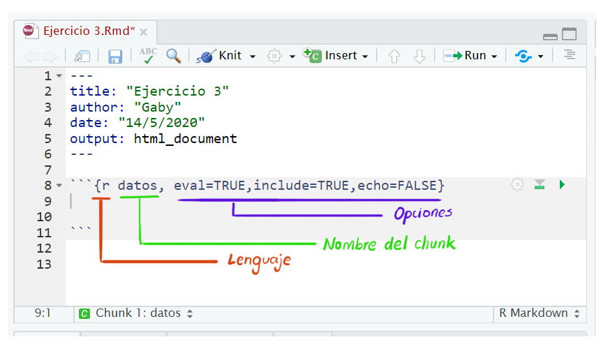
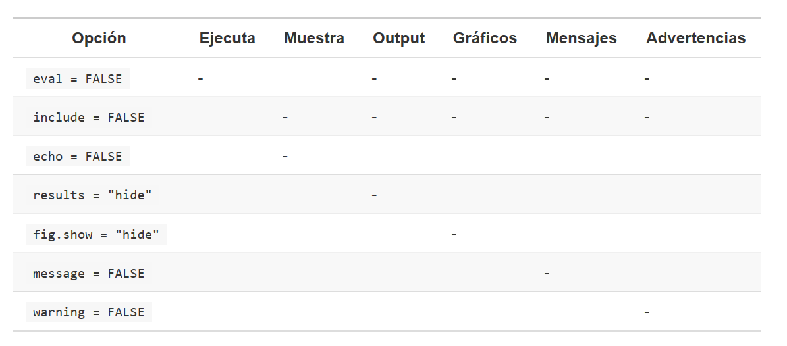

class: middle
```{r setup, include=FALSE}
knitr::opts_chunk$set(echo = TRUE, message=FALSE, warning=FALSE, fig.retina = 3)
library(icon)
```
```{css, echo= FALSE}
.silver{color: silver;}
.gray{color: darkgray;}
```

<!-- <div class="my-footer"><span>text</span></div>
-->

.pull-left[
# Taller de RMarkdown
## Data UC
### .gray[Aprendamos sobre reportes automáticos y análisis reproducibles.]
### .gray[Gabriela Sandoval]
### .gray[14/mayo/2020]
]

.pull-right[
.center[

]]
---
class: middle

## Gaby Sandoval


Estudiante del Doctorado en Estadística de la UC. 

Co-organizadora de [RLadies-Santiago](https://www.meetup.com/es/rladies-scl/).

Pueden encontrarme en:

[`r fa(name = "twitter")`@gabysandovalm](http://twitter.com/gabysandovalm)  
[`r fa(name = "github")` @gabysandovalm](http://github.com/gabysandovalm)

---
class: middle
# Sobre el taller

<small>Ilustración por: Allison Horst, adaptación de: [R4DS](https://r4ds.had.co.nz/explore-intro.html)</small>

---
class: middle
# ¿Qué es necesario para este taller?

- Conocer sobre R y RStudio (recomendable).
- Tener una cuenta en **RStudio Cloud** (importante si queremos generar archivos en formato pdf y no tenemos instalado Miktex en nuestro computador).
- Tener ganas de aprender algo que facilitará nuestro trabajo.

## Objetivo: 
>Conocer la herramienta RMarkdown para generar reportes automáticos y hacer reproducibles nuestros análisis. 

---
class: middle
# Generalidades sobre R
- [**R**](https://www.r-project.org/about.html) es un **lenguaje** y entorno para computación estadística y gráficos. En este entorno se implementan técnicas estadísticas y se extiende muy facilmente a través de **paquetes**. Está disponible como software libre.

- [**RStudio**](https://rstudio.com/products/rstudio/) es un **entorno de desarrollo integrado** (IDE) para R. Incluye varios elementos que facilitan las tareas que llevamos a cabo (entre ellas la generación de reportes). Esta disponible en versión open source y comercial. 

---
background-image: url(images/R.png)
background-size: 90% 70%
background-position: 50% 60%

## .gray[Así es como se ve R] 


---
background-image: url(images/RStudio.PNG)
background-size: 90% 70%
background-position: 50% 60%

## .gray[RStudio IDE]

---
background-image: url(images/RSC.png)
background-size: 90% 70%
background-position: 50% 60%
## .gray[RStudio Cloud]

---
class: middle
background-image: url(images/rm.jpg)
background-size: 45%, 60%
background-position: 95% 88%

# ¿Qué es RMarkdown?

> Un marco de referencia para autoría de documentos para la ciencia de datos, combinando códigos, resultados y texto.

# ¿Por qué RMarkdown?
<small> .pull-left[
Mis razones:

Lo que necesito está en un solo archivo con extensión `.Rmd`.

Se puede convertir a diferentes formatos.

Es más facil entender lo que hice y evitar errores.

Infinitas posibilidades para personalizar.

Es **reproducible**.
]
</small>
---
class: middle

## .gray[De forma general se puede decir que:]

Un archivos de R Markdown se puede usar de tres formas:

1. **Comunicarse** con los tomadores de decisiones (interés en las conclusiones y no en el código).

2. **Colaborar** con otros científicos, incluyendo a tu "yo" del futuro (interés en código y conclusiones )

3. Un ambiente para hacer ciencia de datos como un **notebook** de laboratorio (capturar lo que hacemos y lo que estamos pensando cuando lo hacemos).

<br>
<br>
<br>
<small>Fuente: [R para Ciencia de Datos](https://es.r4ds.hadley.nz/r-markdown.html)
---
background-image: url(images/rmd.png), url(images/flujo.png)
background-size: 45%, 60%
background-position: 50% 25%, 50% 95%
# ¿Cómo funciona? 
Un archivo de RMarkdown es un archivo de texto plano con extensión `.Rmd`

<br>
<br>
<br>
<br>
## .gray[Flujo de trabajo]

<br>
<br>

---
background-image: url(images/new_rmd.png)
background-size: 45%
background-position: 50% 70%

# Crear un nuevo `.Rmd`
.center[File > New File > RMarkdown...]

---
# Estructura de un `.Rmd`

````
--- 
title: "Ejercicio1"
author: "Gaby"
date: "14/5/2020" 
output: html_document
--- 

## R Markdown

This is an R Markdown document. Markdown is a simple 
formatting syntax for authoring HTML, PDF, and 
MS Word documents...

You can embed an R code chunk like this:

```{r}`r ''`
summary(cars)
```

````
---
# Estructura de un `.Rmd`

.left-column[
<br>
<br>
<br>
**YAML**
]

.right-column[
````
--- 
*title: "Ejercicio1"
*author: "Gaby"
*date: "14/5/2020" 
*output: html_document
--- 

## R Markdown

This is an R Markdown document. Markdown is a simple 
formatting syntax for authoring HTML, PDF, and 
MS Word documents...

You can embed an R code chunk like this:

```{r}`r ''`
summary(cars)
```

````
]


---
# Estructura de un `.Rmd`

.left-column[
<br>
<br>
<br>
<br>
<br>
<br>
<br>
<br>
<br>
**TEXTO**
]

.right-column[
````
--- 
title: "Ejercicio1"
author: "Gaby"
date: "14/5/2020" 
output: html_document
--- 

*## R Markdown

*This is an R Markdown document. Markdown is a simple 
*formatting syntax for authoring HTML, PDF, and 
*MS Word documents...

*You can embed an R code chunk like this:

```{r}`r ''`
summary(cars)
```

````
]


---
# Estructura de un `.Rmd`

.left-column[
<br>
<br>
<br>
<br>
<br>
<br>
<br>
<br>
<br>
<br>
<br>
<br>
<br>
<br>
<br>
**CHUNK 
(CÓDIGO)**
]

.right-column[
````
--- 
title: "Ejercicio1"
author: "Gaby"
date: "14/5/2020" 
output: html_document
--- 

## R Markdown

This is an R Markdown document. Markdown is a simple 
formatting syntax for authoring HTML, PDF, and 
MS Word documents...

You can embed an R code chunk like this:

*```{r}`r ''`
*summary(cars)
*```

````
]

---

# YAML (“yet another markup language”)

Contiene los metadatos de mi documento, permite controlar las configuraciones de todo el documento. 

--

## .gray[Ejercicio 1]

El ejercicio 1 consiste en modificar el YAML para obtener diferentes formatos de salida. Usemos por ejemplo:

--

+ `output: pdf_document`

+ `output: html_document`

+ `output: word_document`

---
# Texto

El texto en los `.Rmd` está escrito en Markdown, colección de *convenciones* para dar formato a archivos de texto plano.   
--

### .gray[Formatos:]
.pull-left[
 ```
 Texto plano 
 
 *cursiva* o _cursiva_

 **negrita** o __negrita__
 
 `código`
 
 > cita en bloque
```
]

.pull-right[
Texto plano 
 
*cursiva* o _cursiva_

**negrita** o __negrita__
 
`código`
 
> cita en bloque

]

---
### .gray[Encabezados]

.pull-left[
```
# Nivel 1
 
## Nivel 2
 
### Nivel 3

#### Nivel 4

##### Nivel 5
```
]

.pull-right[
# Nivel 1
 
## Nivel 2
 
### Nivel 3

#### Nivel 4

##### Nivel 5]


---
### .gray[Listas]

.pull-left[
```
+ Elemento no numerado

+ Elemento no numerado

  + Sub elemento

1. Elemento numerado

1. Elemento numerado (automático)
```
]

.pull-right[
+ Elemento no numerado

+ Elemento no numerado

  + Sub elemento

1. Elemento numerado

1. Elemento numerado (automático)
]

--

### .gray[Links]

``` 
[link DATA UC](http://datascience.uc.cl/) 
```
[link DATA UC](http://datascience.uc.cl/)

--

o también:
```
<http://datascience.uc.cl/> 
```
<http://datascience.uc.cl/>


---
### .gray[Imágenes]

```

```
--


--
<br>
<br>
<small> Una guía para formato de texto las pueden encontrar en: [aquí](https://rstudio.com/wp-content/uploads/2015/03/rmarkdown-reference.pdf)
</small>

---
## .gray[Ejercicio 2] 

Vamos a escribir algo de texto.
.center[

]

---
## Chunk o bloque de código

Para ejecutar código en un documento `Rmd` necesitamos insertar un **chunk**:
+ Podemos usar `Ctrl + Alt + I`.
+ También podemos usar el botón de insertar.
+ O escribir manualmente: ```` ```{r} ```` y ```` ``` ````
.center[

]

---

### .gray[Opciones del chunk]
La siguiente tabla muestra lo que se omite con cada opción.
.center[

]

Fuente: [R para Ciencia de datos](https://es.r4ds.hadley.nz/r-markdown.html#bloques-de-código)

---
### .gray[Ejercicio 3]

Vamos a analizar alguno datos y ver cómo funcionan las diferentes opciones de los bloques de código.

.center[

]

---
class:inverse, middle

#Recursos recomendados:

* [R Markdown The Difinitive Guide](https://bookdown.org/yihui/rmarkdown/)

* Cap. 27 de [R for Data Science](https://r4ds.had.co.nz/) (inglés)

* Cap. 27 de [R para Ciencia de Datos](https://es.r4ds.hadley.nz/) (versión español)

* [Cheetsheets](https://rstudio.com/wp-content/uploads/2016/03/rmarkdown-cheatsheet-2.0.pdf)

* [Sitio web de RMarkdown](https://rmarkdown.rstudio.com/)

* La presentación y ejercicios realizados en este taller los encuentran en [este REPOSITORIO](https://github.com/GabySandovalM/RM_DataUC_taller)

---
class: inverse, middle

.center[**!Nos vemos en la próxima sesión!**]
.center[


]
