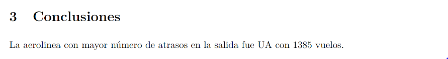

class: middle
```{r setup, include=FALSE}
knitr::opts_chunk$set(echo = TRUE, message=FALSE, warning=FALSE, fig.retina = 3)
library(icon)
```
```{css, echo= FALSE}
.silver{color: silver;}
.gray{color: darkgray;}
```

<!-- <div class="my-footer"><span>text</span></div>
-->

.pull-left[
# Taller de RMarkdown
## Data UC
### .gray[Aprendamos sobre reportes automáticos y análisis reproducibles.]
### .gray[Gabriela Sandoval]
### .gray[19/mayo/2020]
]

.pull-right[
.center[

]]
---
class: middle

## Gaby Sandoval


Estudiante del Doctorado en Estadística de la UC. 

Co-organizadora de [RLadies-Santiago](https://www.meetup.com/es/rladies-scl/).

Pueden encontrarme en:

[`r fa(name = "twitter")`@gabysandovalm](http://twitter.com/gabysandovalm)  
[`r fa(name = "github")` @gabysandovalm](http://github.com/gabysandovalm)

---
class: middle
# Sobre el taller

<small>Ilustración por: Allison Horst, adaptación de: [R4DS](https://r4ds.had.co.nz/explore-intro.html)</small>

---
class: inverse center middle

# RECORDEMOS...

---
# Estructura de un `.Rmd`

.left-column[
<br>
<br>
<br>
**YAML**
] 

.right-column[
````markdown
--- 
*title: "Ejercicio1"
*author: "Gaby"
*date: "14/5/2020" 
*output: html_document
--- 

## R Markdown

This is an R Markdown document. Markdown is a 
simple formatting syntax for authoring HTML, 
PDF, and MS Word documents...

You can embed an R code chunk like this:

```{r}`r ''`
summary(cars)
```

````
]


---
# Estructura de un `.Rmd`

.left-column[
<br>
<br>
<br>
<br>
<br>
<br>
<br>
<br>
<br>
**TEXTO**
]

.right-column[
````markdown
--- 
title: "Ejercicio1"
author: "Gaby"
date: "14/5/2020" 
output: html_document
--- 

*## R Markdown

*This is an R Markdown document. Markdown is a 
*simple formatting syntax for authoring HTML, 
*PDF, and MS Word documents...

*You can embed an R code chunk like this:

```{r}`r ''`
summary(cars)
```

````
]


---
# Estructura de un `.Rmd`

.left-column[
<br>
<br>
<br>
<br>
<br>
<br>
<br>
<br>
<br>
<br>
<br>
<br>
<br>
<br>
<br>
**CHUNK 
(CÓDIGO)**
]

.right-column[
````markdown
--- 
title: "Ejercicio1"
author: "Gaby"
date: "14/5/2020" 
output: html_document
--- 

## R Markdown

This is an R Markdown document. Markdown is a 
simple formatting syntax for authoring HTML, 
PDF, and MS Word documents...

You can embed an R code chunk like this:

*```{r}`r ''`
*summary(cars)
*```

````
]

---
class: inverse, middle
+ Vimos como obtener los formatos de salida: pdf, html y word.

+ Usamos algunas de sintaxis de Markdown para dar formato al texto.

+ Vimos diferentes opciones para mostrar/ocultar/ejecutar código en los chunks.

+ Retomemos el Ejercicio 3

---
# Ejercicio 3

- Usamos el set de datos `vuelos` (disponible en el paquete `datos`) que contiene información de vuelos que partieron desde la ciudad de NY durante el año 2013.

--

Para instalar el paquete `datos`:

```{r eval=FALSE}
#install.packages("remotes")
remotes::install_github("cienciadedatos/datos")
```

--
 
- Nos interesa el  número de vuelos totales y vuelos con más de dos horas de atraso en la salida de las aerolineas United, American y Delta.

--

- Obtuvimos los resultados y los presentamos en una "tabla".

--
- Incluímos un par de gráficos.

--

- Adjuntamos el código usado en los gráficos.

---
class: middle, center

## .gray[Ahora elaboremos un reporte base con esa información...]

--
## Para luego modificarlo `r icon::fa(name = "rocket")`

---
# Personalización del documento

La personalización va a depender del formato de salida. Empecemos con el formato .pdf

--

## Imágenes

Una imagen se puede insertar con ``. 

Sin embargo, una buena opción es usar la función `include_graphics()` del paquete `knitr`.

````markdown
`r ''````{r}
knitr::include_graphics("ruta/nombre.jpg")
``` ```` 

---

Al insertar la imagen de esa forma podemos usar algunas opciones del chunk y tener mayor control sobre las características, por ejemplo:

````markdown
`r ''````{r aerofoto, out.width="50%",fig.align='center',fig.cap="Aerolíneas principales"}
knitr::include_graphics("aerolineas.jpg")
``` ````
--

Nos da como resultado en el reporte:

```{r echo = FALSE, fig.align="center",fig.retina=3,out.width="90%"}

```


---
## Tablas

Las salidas de de R en el documento se ven así:

```{r echo = FALSE, fig.align="center",fig.retina=3,out.width="90%"}

```

Para darle formato a la tabla podemos usar la función `kable()` del paquete `knitr`.

````markdown
`r ''````{r}
knitr::kable(nombre_matriz_df)
``` ````

Otro paquete de R muy útil para dar formato a tablas es `kableExtra`. Pueden consultar este [link](https://haozhu233.github.io/kableExtra/awesome_table_in_pdf.pdf) o mi cheatsheet de [tablas](https://github.com/GabySandovalM/RLadiesSantiago/blob/master/Taller_tablas/documento_tablas.pdf)
---

Por ejemplo:

````markdown
`r ''````{r}
knitr::kable(resultado)
``` ````
--

También podemos usar otros argumentos por ejemplo:

````markdown 
`r ''````{r}
knitr::kable(resultado,caption = "Número de vuelos por aerolinea",digits = 2)
``` ```` 
--

Y obtenemos los siguientes resultados:

```{r echo = FALSE, fig.align="center",fig.retina=3,out.width="90%"}

```

---
## Gráficos

Al igual que con las imágenes (que no se construyen en R), en este caso también podemos usar las opciones del chunk para parametrizar las características del output.

````markdown 
`r ''````{r grafico1, echo=FALSE, fig.align='center',fig.height=2,fig.width=3,fig.cap="Número de vuelos atrasados por mes"}

vuelos %>% filter(aerolinea %in% c("UA","AA","DL"), atraso_salida >= 120)%>% 
  group_by(aerolinea,mes) %>% 
  summarise(atrasados =n()) %>% 
  ggplot(aes(x=as.factor(mes),y=atrasados,fill=aerolinea)) + 
  geom_col(position = "dodge") + 
  theme_bw() + xlab("mes")

``` ````
---
Este código nos da como resultado en el informe:

```{r echo = FALSE, fig.align="center",fig.retina=3,out.width="90%"}

```

---
## Código en línea

Cuando hacemos referencia a datos en el texto podemos enlazar resultados obtenidos y/o hacer cálculos usando **código en linea**.

Por ejemplo:

```{r echo = FALSE, fig.align="center",fig.retina=3,out.width="90%"}

```

Proporciona como resultado: 

```{r echo = FALSE, fig.align="center",fig.retina=3,out.width="90%"}

```
 

---
## Algunas configuraciones adicionales
.pull-left[
````markdown
--- 
title: "Reporte de Vuelos"
author: "Gabriela Sandoval"
date: "19/5/2020"
*output: pdf_document
--- 
````
]

.pull-right[
```{r echo = FALSE, fig.align="center",fig.retina=3,out.width="90%"}

```
]

---
## Algunas configuraciones adicionales
.pull-left[
````markdown
--- 
title: "Reporte de Vuelos"
author: "Gabriela Sandoval"
date: "19/5/2020"
*output:
*  pdf_document: 
*    toc: true
---
````
]

.pull-right[
```{r echo = FALSE, fig.align="center",fig.retina=3,out.width="90%"}

```
]


---
## Algunas configuraciones adicionales
.pull-left[
````markdown
--- 
title: "Reporte de Vuelos"
author: "Gabriela Sandoval"
date: "19/5/2020"
output:
  pdf_document: 
    toc: true
*   toc_depth: 2
---
````
]

.pull-right[
```{r echo = FALSE, fig.align="center",fig.retina=3,out.width="90%"}

```
]

---
## Algunas configuraciones adicionales
.pull-left[
````markdown
--- 
title: "Reporte de Vuelos"
author: "Gabriela Sandoval"
date: "19/5/2020"
output:
  pdf_document: 
    toc: true
    toc_depth: 2
*   number_sections: true
---
````
]

.pull-right[
```{r echo = FALSE, fig.align="center",fig.retina=3,out.width="90%"}
knitr::include_graphics("images/pdf4.png")
```
]


---
# Personalización de un reporte en html.
.pull-left[
````markdown
--- 
title: "Reporte de Vuelos"
author: "Gabriela Sandoval"
date: "19/5/2020"
*output: html_document
---
````
]

.pull-right[
```{r echo = FALSE, fig.align="center",fig.retina=3,out.width="90%"}

```
]


---
# Personalización de un reporte en html.
.pull-left[
````markdown
--- 
title: "Reporte de Vuelos"
author: "Gabriela Sandoval"
date: "19/5/2020"
*output:
*  html_document: 
*   toc: true
---
````
]

.pull-right[
```{r echo = FALSE, fig.align="center",fig.retina=3,out.width="90%"}

```
]


---
# Personalización de un reporte en html.
.pull-left[
````markdown
--- 
title: "Reporte de Vuelos"
author: "Gabriela Sandoval"
date: "19/5/2020"
output:
  html_document: 
   toc: true
*  toc_float: true
---
````
]

.pull-right[
```{r echo = FALSE, fig.align="center",fig.retina=3,out.width="90%"}

```
]


---
# Personalización de un reporte en html.
.pull-left[
````markdown
--- 
title: "Reporte de Vuelos"
author: "Gabriela Sandoval"
date: "19/5/2020"
output:
  html_document: 
   toc: true
   toc_float: true
*  number_sections: true
---
````
]

.pull-right[
```{r echo = FALSE, fig.align="center",fig.retina=3,out.width="90%"}

```
]

---
# Personalización de un reporte en html.
.pull-left[
````markdown
--- 
title: "Reporte de Vuelos"
author: "Gabriela Sandoval"
date: "19/5/2020"
output:
  html_document: 
   toc: true
   toc_float: true
   number_sections: true
*  theme: darkly
---
````
]

.pull-right[
```{r echo = FALSE, fig.align="center",fig.retina=3,out.width="90%"}

```
]


Otros formatos se pueden ver [AQUI](https://bootswatch.com/)


---
# Personalización de un reporte en Word.

.pull-left[
````markdown
--- 
title: "Reporte de Vuelos"
author: "Gabriela Sandoval"
date: "19/5/2020"
*output: word_document
---
````
]

.pull-right[
Por defecto Word nos entrega un reporte con el siguiente formato:
```{r echo = FALSE, fig.align="center",fig.retina=3,out.width="90%"}

```
]

---
# Personalización de un reporte en Word.

Pero podemos incluir un formato desde un archivo `.docx` que se usa como referencia:

````markdown
--- 
title: "Reporte de Vuelos"
author: "Gabriela Sandoval"
date: "19/5/2020"
output:
  word_document: 
   toc: true
   toc_depth: 1
*  reference_docx: formato.docx
---
````

---
class:inverse, middle

#Recursos recomendados:

* [R Markdown The Difinitive Guide](https://bookdown.org/yihui/rmarkdown/)

* Cap. 27 de [R for Data Science](https://r4ds.had.co.nz/) (inglés)

* Cap. 27 de [R para Ciencia de Datos](https://es.r4ds.hadley.nz/) (versión español)

* [Cheetsheets](https://rstudio.com/wp-content/uploads/2016/03/rmarkdown-cheatsheet-2.0.pdf)

* [Sitio web de RMarkdown](https://rmarkdown.rstudio.com/)

* La presentación y ejercicios realizados en este taller los encuentran en [este REPOSITORIO](https://github.com/GabySandovalM/RM_DataUC_taller)

---
class: inverse, middle

.center[**!Hasta la próxima!**]
.center[


]
